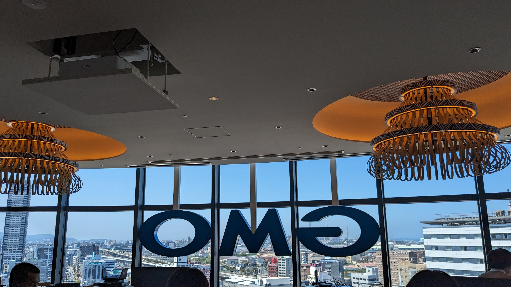
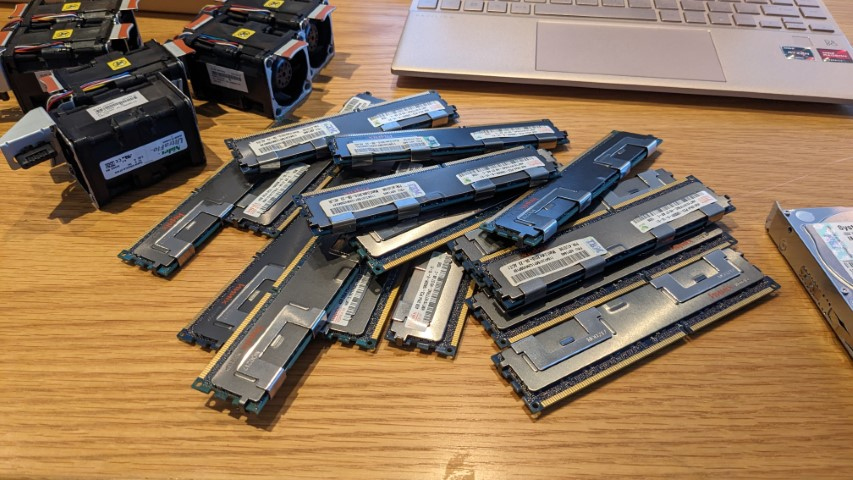
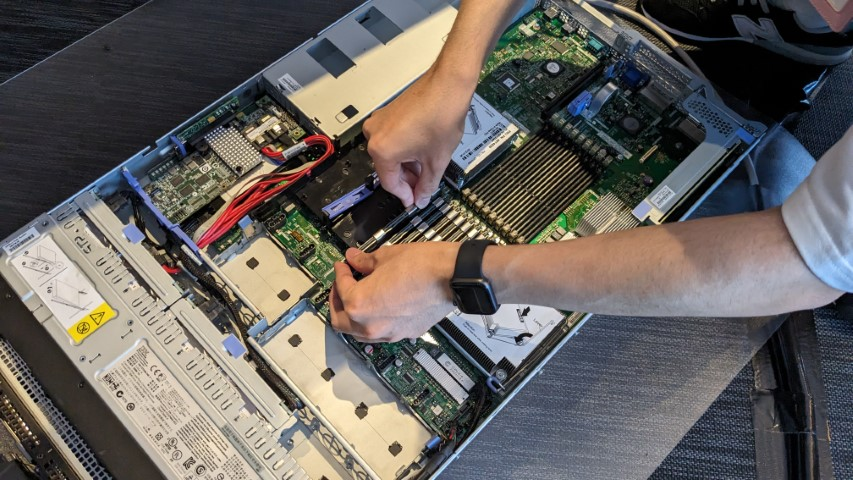
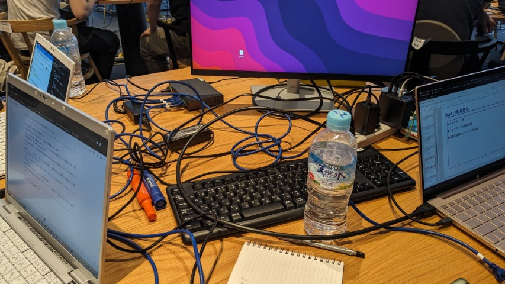
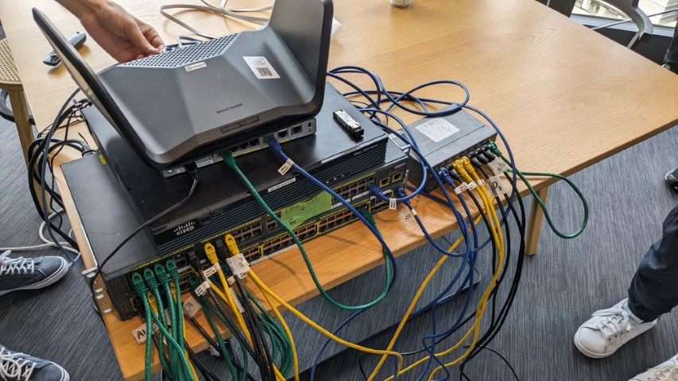
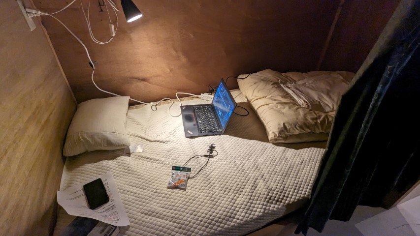
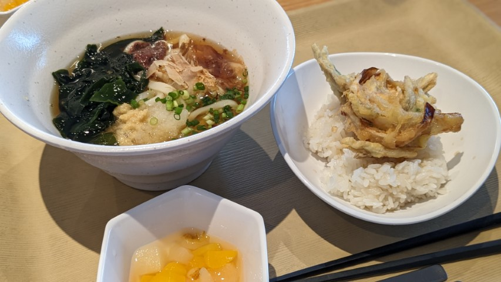
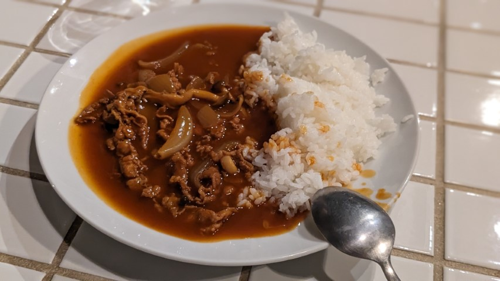

この記事は[ConoHa Advent Calender 2023](https://qiita.com/advent-calendar/2023/conoha)の21日目の記事になります。

まずはこのはちゃん10周年，おめでとうございます！

私は今夏，GMOインターネット株式会社 KitaQオフィスにお邪魔してこのはちゃんに会って……
ではなく，GMOさんのエンジニアインターンに参加させていただきました。

ということでインターンの内容や様子について簡単に紹介したいと思います。

今後同様のインターンに行かれる方や，雰囲気を知りたい方の少しでも参考になれば幸いです。

GMO KitaQオフィスの内側から。

.jpg>)

オフィスエントランスに設置されていたでっかいこのはちゃんパネル。

## インターンについて
今回参加したインターンの正式名称は「5daysインターン インフラコース」といい，
主にインフラエンジニアの業務を体験するコースです。

同時期に「Webアプリケーションコース」「セキュリティコース」も開催されていましたが，
私はインフラエンジニアに興味があったのでこちらを選びました。

## ワーク内容
インターンのテーマは「Conohaの開発工程をインフラエンジニアの立場で体験しよう」と設定されていました。
Conohaを題材にサービスの設計から運用，カスタマ対応まで一気通貫に体験するというストーリーになっています。

また学生に達成してほしい目的として

1. インフラエンジニアの仕事がとても多様であることを踏まえた上で，具体的な業務に触れて「目指したいインフラエンジニア」像をはっきりさせる
2. GMOの働く場所やパートナー(社員)，サービスに関心を持ってもらう

という2点が挙げられていました。

### 1日目 
1日目はインターンのオープニングということで，参加者同士の交流や概要説明，オフィスツアーなどが中心でした。
インターン期間中は4人チームでワークに取り組むので，自己紹介をしたり，チームのフラッグ(アイコン)を生成AIで作ったりといったアイスブレイク的な内容が中心です。
人見知り気味なのでちょっと緊張しましたが，同じ目的で来ている学生ばかりなので結構すぐに打ち解けられました。

1日目午後からは早速座学です。
Conohaというサービスをどのように企画し，求められる仕様に落とし込むかという「企画」の仕事を体験しました。
また，要求仕様が決まった段階でアーキテクチャをどう設定するかという「設計」の仕事についての講義も。

個人で小さなサービスを開発することはあっても，学生の身ではなかなか商用サービスの設計について考える機会は少ないのでとても興味深い内容でした。

1日目最後にはハードウェアやデータセンタの選定というより低レイヤな視点での講義もありました。
これも個人では触れる機会のないお話で面白かったです。

### 2日目
2日目は実際に物理サーバを構築してみよう！という実習です。

こんな感じで，実際のラックマウントサーバのパーツを組み立て(さすがにイチからではないですが)，起動し，OSをインストールするところまで取り組みました。
できるだけ実務に即した形で，英語のマニュアルと突き合わせながら組み立てました。

私は自作PCの制作経験があったので，正直それとどう違うんだろう？と思っていたのですが，電源が冗長化されていたり，メモリが通常と異なる指し方をしたりと
家庭用PCとサーバは全く違っていました。

### 3日目
3日目はネットワーク構築と，仮想化基盤の構築の演習です。

このように本番用のネットワーク機器を使って演習用のネットワークを構築しました。

私はYAMAHAルータの操作経験があったのですが，演習で使用したルータはCisco製で勝手が違って結構苦戦しました。
ネットワーク機器のコンフィグ，独特の難しさがある……。

ネットワークが完成したら2日目にインストールしたOSにVMを構築し，翌日以降の準備をしました。

### 4日目
4日目はこれまでのインフラメインの内容から離れ，ちょっと開発っぽいことをしました。
RabbitMQというミドルウェアを使って，指定された課金サービスを実装しよう！という課題。

個人的には5日間でここの課題が一番難しかったです。
最初特に何も考えず，経験の浅いGo言語を選んで実装しようとしたら本質から離れた部分で詰まりまくり，慌ててJavaScriptに変更したものの大幅なタイムロス。
ぶっつけ本番で実装を始める前にしっかり計画を練ってスタートすることの重要性を痛感……。
結局，班内の進度が早かった人に全面的に頼ってなんとか最低限の条件をクリアすることができました。

4日目の午後は監視ソフトZabbixを導入してVMの監視を設定しようという演習です。
Zabbixには前から興味があったので，実践的な設定を触れてかなり面白かったです。
自宅のサーバにも導入してみようと思っています。

### 5日目
いよいよ最終日。

この日はまずカスタマからの問い合わせに対応する演習からスタートしました。
トラブルシューティングの対応が非常にシステマティックに処理されていることが見えて，普段お客様側で使っているサポート窓口の裏側を覗いた気分でした。

午後から5日間の成果をプレゼンする時間がありました。
発表内容はフリーで，チームで協議して決めていきます。

色々アイディアはあったのですが，時間の都合もありこれまでの学習内容をまとめつつ，各々の目標達成度合いを振り返るという堅実な~~面白みのない~~内容になりました。
もうちょっとユニークな話ができればよかったなとは思っています。

最後にスタッフさんからのまとめコメント，プレゼンの優秀な班の表彰等のイベントで終了。

インターン終了後，社内バー(社内にバーカウンターがあるのです)で社員さんとの懇親会に参加しました。

なんとDJブースもあった。

## ワーク内容について
全体的に非常にボリュームのある内容で満足感は高かったです。
インターンでありがちな「業務の端にちょっと触れて終わる」みたいな感じではありません。
しっかりと作られたカリキュラムに専任のエンジニアの方がサポートでついていただけるという恵まれた環境で，単なるインターンというよりは専門の講習会に来ている感じで，終始「これをタダで受けていいのかな(なんなら交通費までもらってる)」という気持ちでした。

また各日の夕方にエンジニアの方と1on1のフィードバックミーティングをしていただけたのも，気軽に困り事や進捗状況を相談できてありがたかったです。

最後にワーク全体のレベル感について。インターンの応募画面に「こんな人に来ていただきたい」という条件が書かれています。
これを見ると「CLIに慣れていてLinuxを扱える」「ネットワークの基礎的な知識がある」等の」という条件が掲載されています。
個人的にはだいたいこの通りのレベル感かなと思いました。(4日目の開発課題だけかなり難易度高めでしたが……)

全くインフラの知識がないとちょっと厳しいかと思いますが，基本情報技術者試験の関連分野を勉強した，くらいの前提知識があれば問題なくついていけるのではないでしょうか。

参加者はかなり幅広く，これからインフラを勉強していきたいという人から，既にネスペまで取得していてプロレベルの知識がありますという人まで色々でした。

## インターン中の生活

インターン期間中は泊まり込みということで，近くのドミトリーを確保していただきました。

こんな感じのスペースが割り当てられます。
ドミトリーを使ったことはなかったのですが，秘密基地っぽくて意外と快適でした。

ただし，二段ベッドということもあり，物音や光は結構はいってくるので，敏感な人はアイマスクや耳栓を用意しておくのがオススメです。
参加者の中にもあまり寝られなくて大変だった……と言っている人がいました。

自分はアイマスク＋耳栓＋睡眠薬の最強コンボでぐっすりでした。

そして期間中のご飯ですが，朝は自分で調達する必要がありますが，昼はGMOさんの社食またはお弁当を，夜はドミトリーで定食を用意していただけます。

お昼のお弁当と，

社食です。めちゃ美味しかった。

夜ご飯です。

実は昨年まで夕食のクオリティがいまいちという声があったようなのですが，フィードバックを受けて今年から改善していただけたようです。ありがたい。

あとは集団生活なので，結構仲良くなるイベントが発生します。自分たちは3日目か4日目に参加者を募って近所の銭湯に行きおしゃべりするなどしました。
話してみるとみんなバラバラの地域から来ていて驚きます。

## まとめ

KitaQオフィスから見た小倉駅

今回のインターンは総じて有意義な時間になりました。

特に普段触ることのできない業務レベルのインフラに関わることができたのが印象的でした。
ITインフラに着目したインターンというのは珍し目ですし，興味を持たれた方はぜひ応募してみてください。
