## 概要
私のデミオ(DE3FS型)には購入時から純正ナビがついていたのですが，AUX入力端子はついていませんでした。ただ，純正ナビ背面にUSB/AUX接続ケーブルを接続することで，割と簡単にAUX端子を増やせるとのこと。  
取付作業自体はそんなに難しくなさそうだったので，自分でつけてみました。

ただし，今回私が試した方法は純正オプションのケーブルを使用しておらず，またナビの取り外し自体も専門業者による作業を前提としていると思われますので，記事内容を実践する場合はあくまで自己責任でお願いします。   

## USB/AUXケーブルの接続先について
DEデミオの純正ナビ(パイオニア C9P8 V6 650)の背面にはUSB/AUX接続用端子がついています。
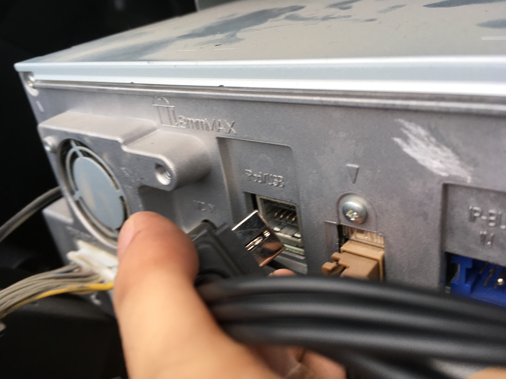

この端子に接続するケーブルとして，純正オプション品のC9P9 V6 572という型番のケーブルが用意されているので，USB/AUX端子を増やそうとすると本来はこのケーブルをディーラー等で取り寄せる必要があります[^1]。
[^1]:参考リンク：(https://www.mazda.co.jp/globalassets/assets/carlife/accessories/support/info_lib/history/common/pdf/ipod/info_lib_ipod06_ipod12.pdf)

しかしながらこのケーブル，ネットショップでは8千円近い値段になっており，またディーラーで取り寄せても4千円以上するらしく，ただのケーブルにそれはちょっと……と思っていました。  
ところが，色々調べてみると，同等品の[カロッツェリア(パイオニア) CD-UV020M](https://www.amazon.co.jp/gp/product/B0085GICQ0)というケーブルでも目的が達成できるという情報を，このケーブルのAmazonレビュー欄で[発見](https://www.amazon.co.jp/gp/customer-reviews/R2CKNYO4N0W9PH)しました。

> コネクタの形状等から、こちらのCD-UV020Mが使えるのではないかと予想。「誰か試した人はいないかな？」と思いネットを検索するも、何故か一切情報が出てきませんでした。
そこで人柱覚悟で注文し、いざ取り付け。結果は、バッチリ使えました！USBメモリも差し込みましたが、全く問題なく再生出来ました。

こういう微妙にマイナーな作業で人柱を引き受けてくださった先人がいると本当にありがたい限りですね。

そういうわけで，早速こちらのケーブルを購入して実践してみました。

## 必要な道具など

### ケーブル
* [カロッツェリア(パイオニア) USB/AUX接続ケーブル CD-UV020M](https://www.amazon.co.jp/gp/product/B0085GICQ0)

### 工具

#### 必須なもの
* プラス/マイナスドライバー
* 内装剥がし
* ソケットレンチ(10mm径)
  * 詳細は後述しますが，ソケットレンチにエクステンションバーがあると作業が楽だと思います

#### あると助かったもの
* iFixit Essential Tool Kit

内装剥がしは近所のホームセンターで買ってきたエーモンの3種セットを使用しました。
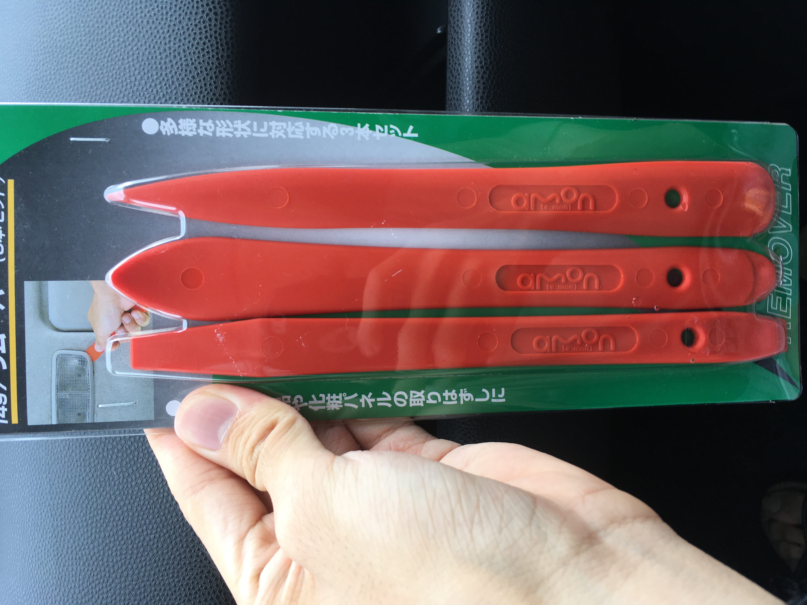

## 作業手順
純正ナビの取り外し方法については，カロッツェリア公式サイトの[車種別取付情報](https://justfit.carrozzeria.pioneer/disasm/MZ0002500_201107-201409)を大いに参考にさせていただきました。というかほぼこのガイドに従っているだけです。  
ただ，こちらのガイドには写真がついていないので，一応この記事で手順に沿った写真を載せておきます。  
細かい記述は省略気味なので，ガイドと一緒に見てもらえると分かりやすいかと思います。

### 1. コンソール・サイドカバーの取り外し

はじめにコンソール・サイドカバーを取り外します。

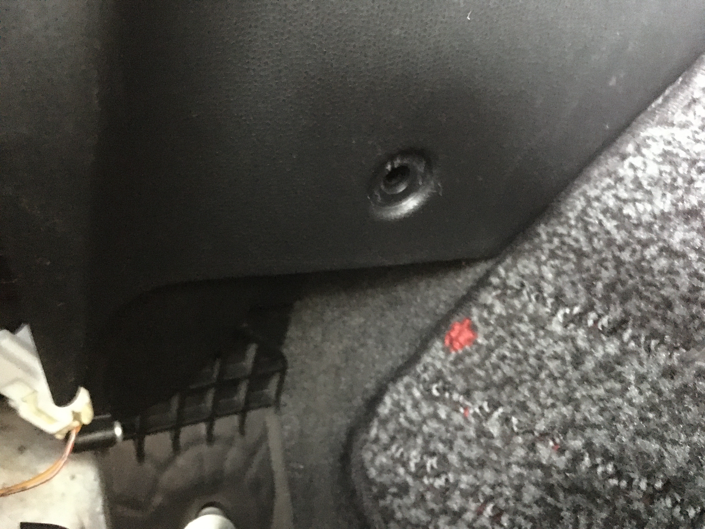

サイドカバーの奥についているファスナーを外しておきます(画像は外した後)。  

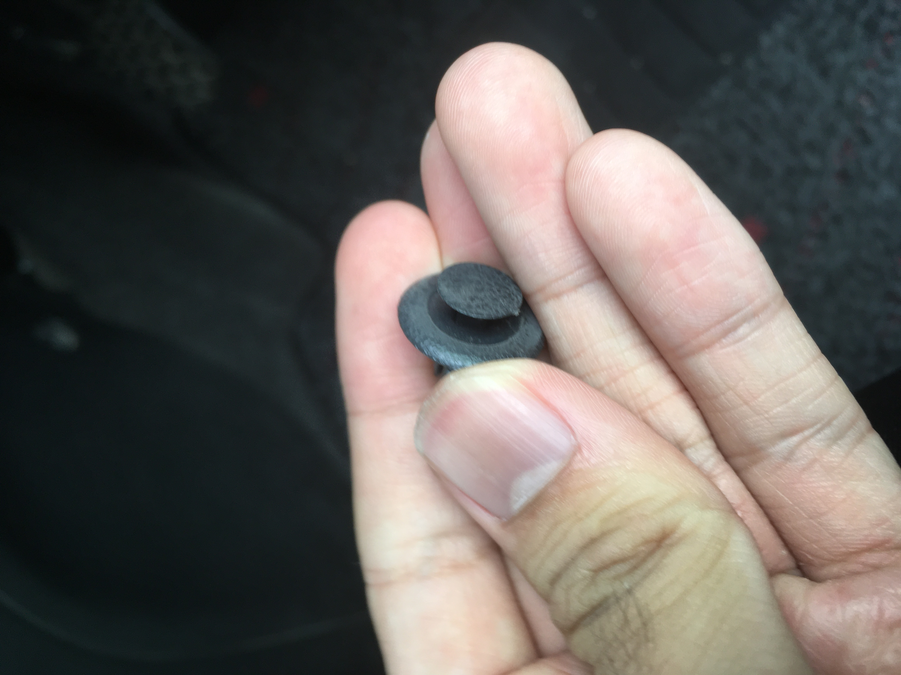

このファスナーはリベットタイプと呼ばれるものらしく，中心の一回り小さなピンの下にマイナスドライバーを差し込んで持ち上げるとロックが外れます。特に工具等は必要なく簡単に外れました。

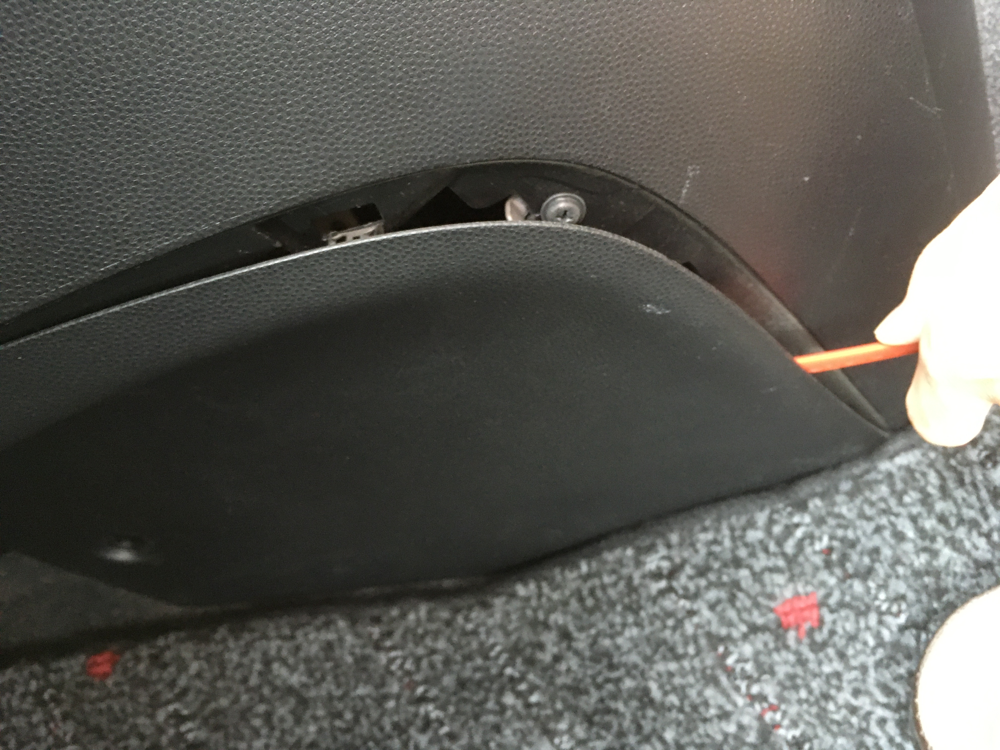

ファスナーを外したら隙間に内装剥がしを差し入れ，こじってはずします。

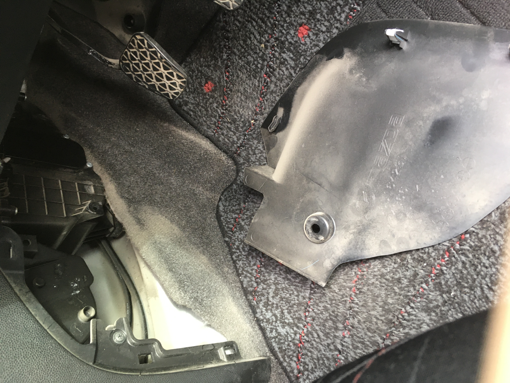

運転席側も同様に取り外します。

### 2. シフトカバーの取り外し
続いてシフトカバーを外していきます。  
シフトカバーにはネジなどはないので，直接内装剥がしを差し入れ，ロックされているクリップを外していけば大丈夫です。  

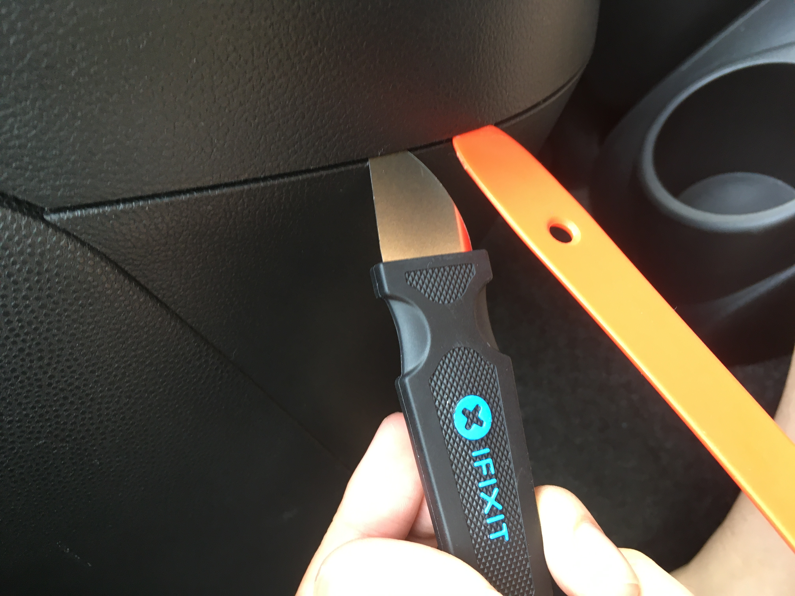

隙間がほとんどなく，内装剥がしが入らなくて苦戦したのですが，ふと思いついてiFixitのスマホオープナー[「Jimmy」](https://jp.ifixit.com/Store/Tools/Jimmy/IF145-259?o=1)で少しだけシフトカバーを持ち上げ，できた隙間にすかさず内装剥がしを突っ込むようにすると，すんなり外れました。

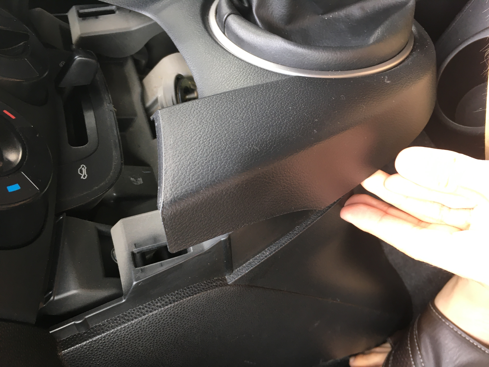
……のはずだったのですが，どうやらMT車の場合先にシフトノブを外しておいたほうが良かったようです。

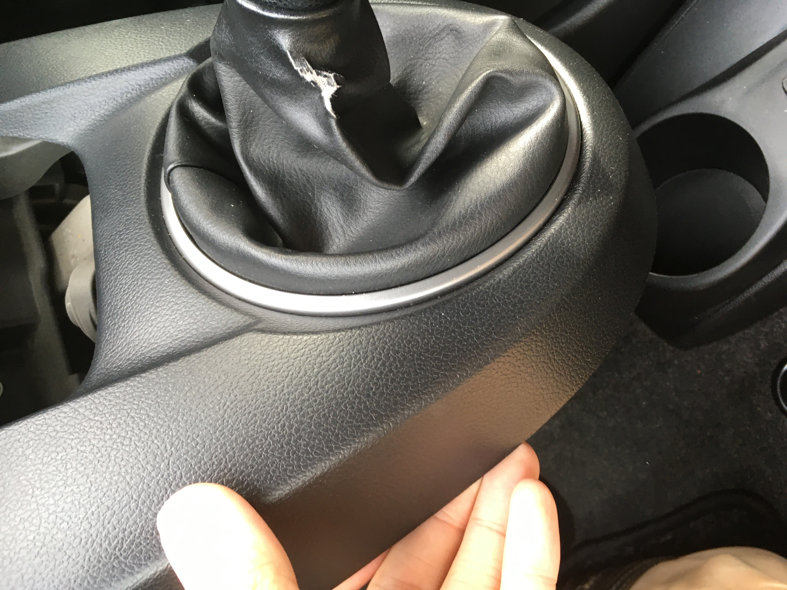
この順番を間違えたおかげで，シフトノブを外す時にシフトカバーごとぶん回す羽目になってしまい，結構めんどくさかったです。

シフトカバーを外したところです。

### 3. シフトコンソールカバーの取り外し
シフトカバーが外れたら，その側面のシフトコンソールカバーを取り外します。

まずシフトコンソールを留めている2つの両側のネジを外します。

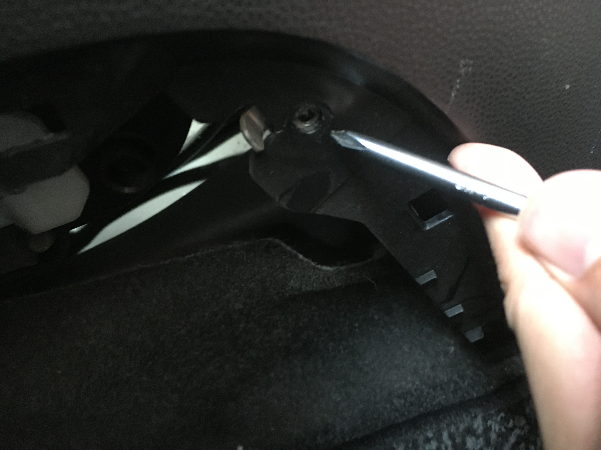
左右両方のネジを外しておきます。

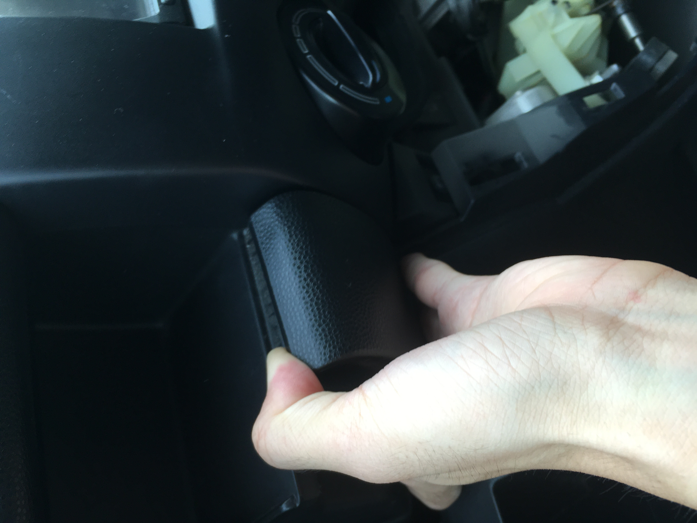
続いて，シフトコンソールカバーの左右の上部の留まっている部分(ナビの左側)を手で取り外します。  
結構力を入れないと外れないです。
反対側(ハンドル側)も同様に外しておきます。

ネジと留め具が外れたら，シフトコンソールカバー全体を手前に引いて外します。左右両側9箇所にクリップで固定されていますので，
少しずつ力を入れながら外しました。

この辺りはカロッツエリアのガイドの図解が分かりやすいのでそちらを見たほうがいいかもしれません。

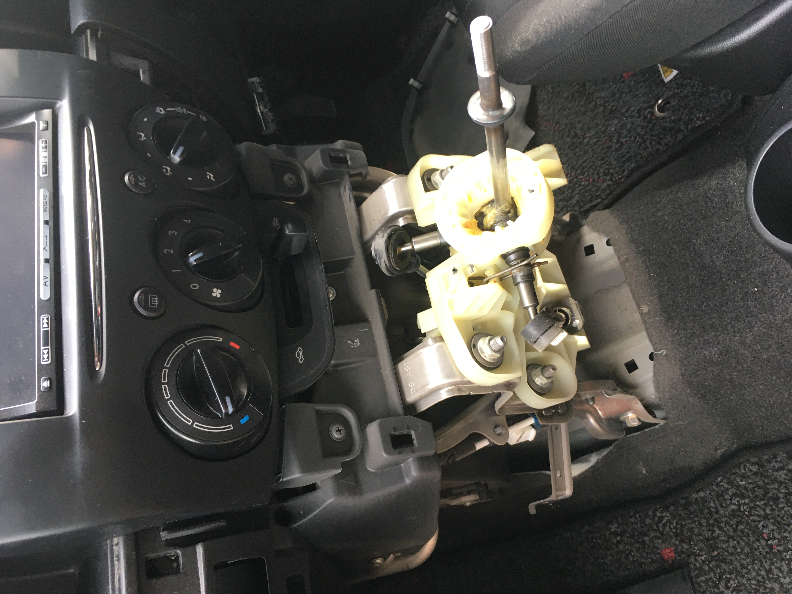
シフトコンソールカバーが外れたところです。

### 4. グローブボックスの取り外し
シフトコンソールカバーが外れたら，グローブボックスを取り外していきます。

グローブボックスを開けると，奥に紐で吊り下げる形で固定されているのが見えます。(写真撮り忘れ)  
この固定部を外したら，グローブボックス左右の側面を内側に押し込むようにしながら手前に引いてスポッと抜きます。

左右にこのような突起があるので，片方ずつ外すと楽に抜けました。

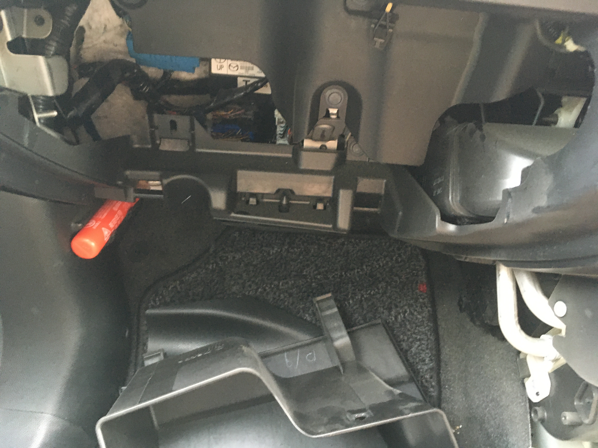

### 5. 純正ナビの取り外し
やっと純正ナビを取り外すところまで来ました。

まず，シフトノブ左右についているナビの固定ネジを外します。

次に，グローブボックスを外したことで生まれた空間から手を伸ばし，ナビを横から留めているボルトを外すのですが……

この写真の赤丸で囲まれたボルトがインパネとナビマウンタを固定しており，外す必要があります。
その右側のネジは，ナビとマウンタを固定しているネジですので外さなくても大丈夫です。(最初勘違いして外そうとして無駄に苦労した)

ただ，写真からはわかりにくいのですが，このボルトの位置が非常に奥まった場所にあり，めちゃくちゃ外しにくいです。
今回用意したソケットレンチは近所の店で売っていたこういうやつなのですが↓

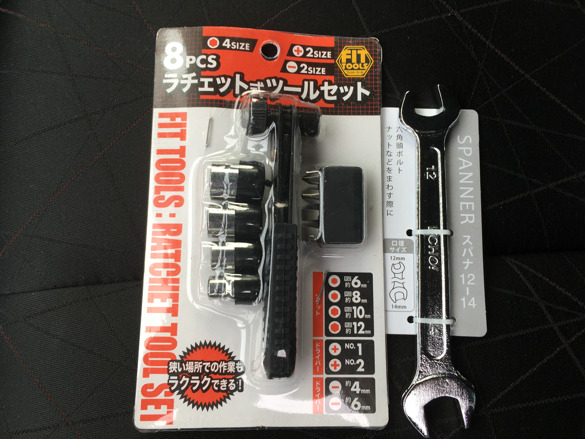

このようなL字型のレンチを差し込むと引っかかってしまい，うまく回りません。ただほんの少しずつなら回るので，私はちょっとずつ動かしてなんとか外しました。

ぶっちゃけめちゃくちゃ大変なので，スムーズに作業したい方はこのようなエクステンションバーを用意することをおすすめします。

https://www.monotaro.com/g/01285404/

ボルトが外れたら，あとはナビを外すだけです。

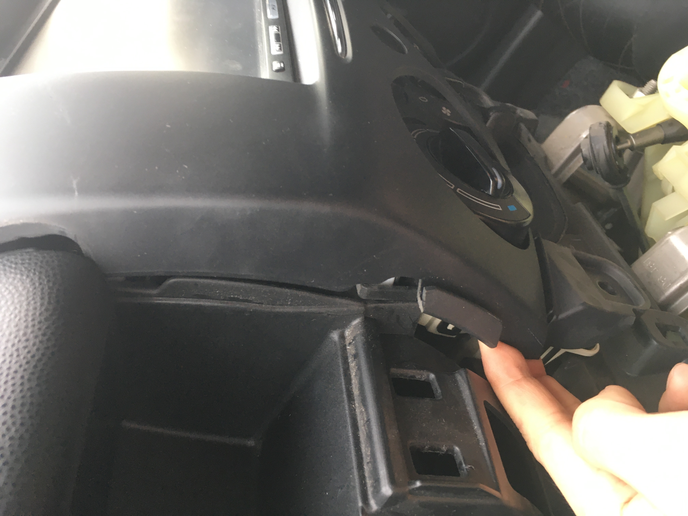

周囲をまんべんなくクリップで固定されているので，適宜隙間に内装剥がしを差し込みながら少しずつ手前に引っ張って外します。

ナビの背面には多数のケーブルが接続されており，ケーブルへのダメージを避けるため本体が外れてもいきなり引っ張り出さないほうが良さそうです。

ナビを引き出せたら，背面に接続されているケーブルの中で一番短いハザードランプケーブルのカプラーを外しておきます。

ナビの背面に購入したケーブルを接続します。

USB/AUXケーブルの取り回しですが，私はナビ背面から左側にケーブルを伸ばし，グローブボックス奥から手前に引き，最終的にグローブボックスの上部の隙間から取り出すことにしました。

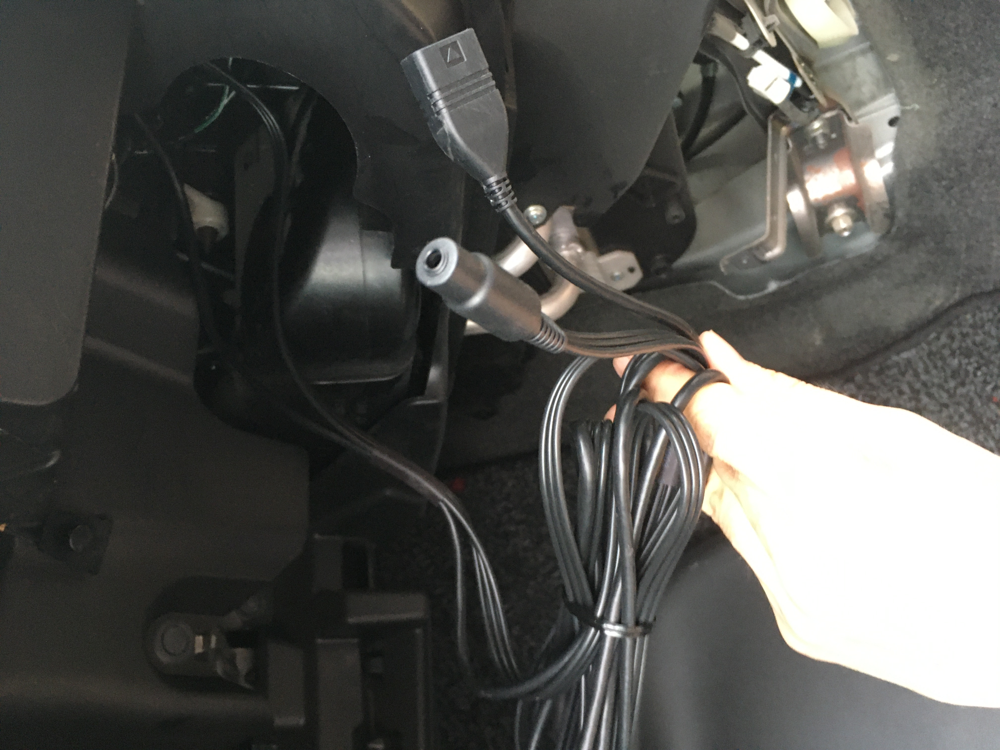

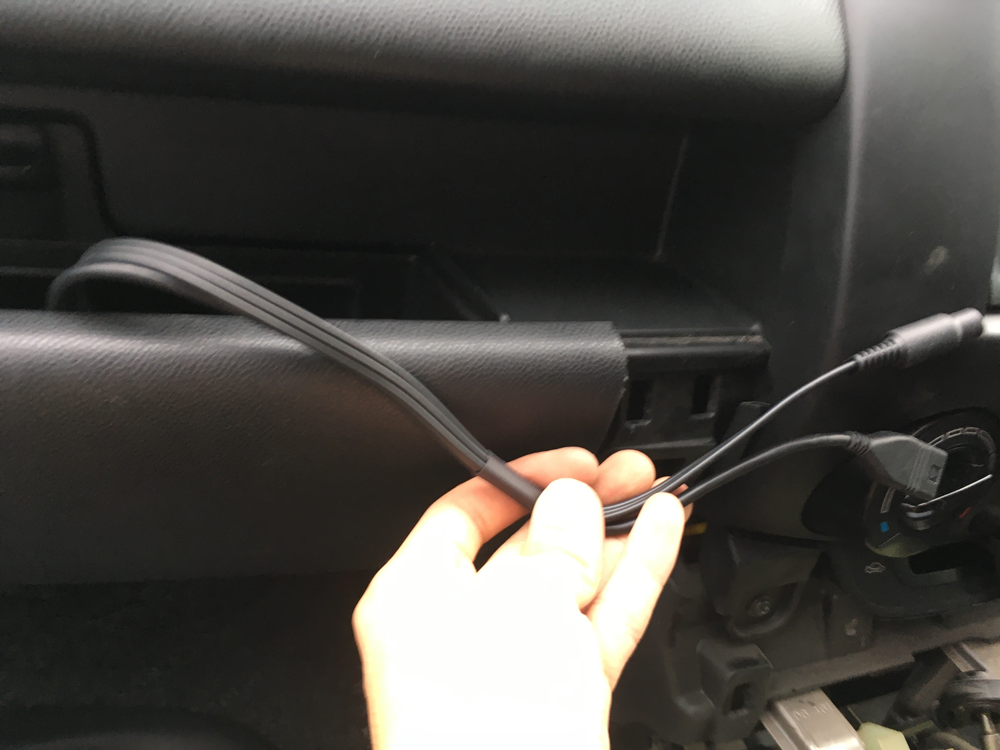

あとはこれまでと逆の手順で各種部品を取り付けて完成です。

### 余談：iPhoneをiPodモードで使用する
このケーブルはUSB/AUXなので，AUX端子のみの接続では純正ナビのオーディオソースのAUXを選択した時に音が出ます。ただし，iPhoneの場合，AUXにイヤホン端子を，USBにLightningケーブルを取り付けるとiPodとして認識され，このようにナビ側に曲情報を転送することができます。

ナビ側で曲情報を認識しているので，ステアリングスイッチで曲送りや一時停止といった操作ができて大変便利です。ただ，私が車載端末にしているのはNexus5xなので，あまりこの機能を使うことはなさそうです。

## 終わりに
うまくできるか若干不安でしたが，丁寧にマニュアルを読んでゆっくり作業すれば大丈夫でした。今後も自分でできそうな作業はできるだけDIYで解決できればいいなと思います。

車のナビを自分で外してあれこれ……という作業は初めてなので記事内容に誤りがあるかもしれません。その場合はTwitter等でご指摘頂ければ大変助かります。
