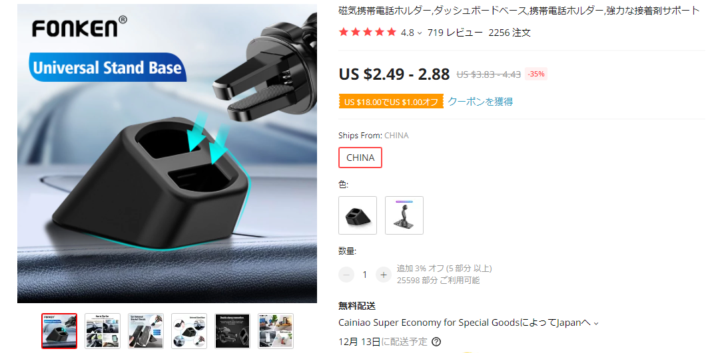
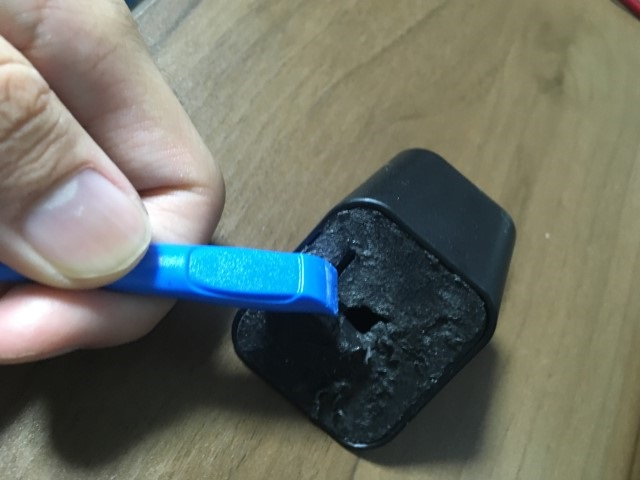
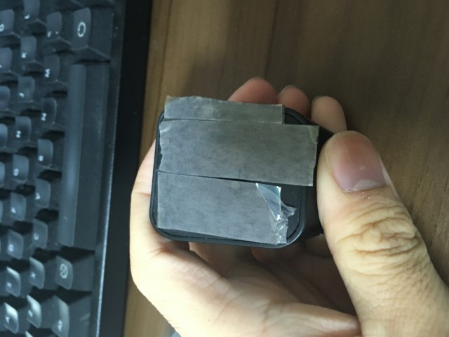

こんにちは。前回に引き続きデミオの内装のお話です。

### インパネ周りにスマホホルダーを取り付けたい
車内にスマホホルダーを取り付けたい場合，取り付け場所としてよく使われるのはエアコンのルーバー部分です。実際，ルーバーに取り付けられるスマホホルダーは世の中にたくさん売られています。

DEデミオのエアコンルーバーもインパネの上方にあるので，スマホホルダーの取り付け位置としては最適です。ところが，なぜかエアコンルーバーがかなり軽く，スマホホルダーをしっかり支えてくれません。

### ダッシュボードにエアコン用アクセサリをマウントするアイテム

どうしたものかと考えていると，友人が便利なアイテムを紹介してくれました。

https://ja.aliexpress.com/item/1005002575294294.html

これはダッシュボードに貼り付けるアクセサリで，いわば「エアコン用アクセサリのダッシュボード用マウンタ」という感じのもののようです。
エアコンルーバーに取り付けられないのなら，ルーバーを模した形状のマウンタをダッシュボードに作ってしまえ！というアイデア。その発想はなかった。

初めて知ったのですが，エアコンルーバーがアクセサリに向いていない車種というのは割とあるらしいですね。このマウンタを紹介していた動画ではダイハツ・コペンで使われていました。



早速Aliexpressで注文したところ，2週間くらい経って無事到着。

アリエクにしては珍しく，キレイな包装です。
背面に両面テープがついており，ダッシュボードに直接貼り付けるタイプ。

早速ダッシュボードに取り付けてみます。

画像がわかりにくいのですが，インパネのエアコンルーバーのすぐ左に取り付けたので，運転中でも操作しやすくいい感じです。

### うまく貼り付い……た？
ところが，貼り付けて丸1日くらい経ったところで，マウンタが重量に耐えられなかったのか剥がれ落ちてきてしまいました。  
私はスマホホルダーに車載端末を入れっぱなしにしていたので，負荷がかかり続けたのが悪かったのかもしれません。

まぁ，中華製で初めからついていた両面テープが弱いのは当たり前，ここまでは想定済みです。

ということで，自分で両面テープをつけ直してみます。
購入したのはこちらの商品。



自動車内装用の両面テープは何種類かあったのですが，3Mというブランドへの安心感でこちらをチョイス。

### 両面テープの貼り直し作業
新しい両面テープをマウンタの裏側に貼っていきます。

ただ，マウンタの裏側にはこのように元の粘着テープがあちこちに残ってしまっています。
まずはこれを取り除きます。

エタノールを噴霧しつつ，プラスチックのヘラ(おなじみiFixitのツールキット)でガシガシ剥がしていきます。

黙々と剥がすこと約20分，キレイに取り除けました。

ついでに，面がツルツルより少し荒れていたほうがテープがくっつきやすいかと思ったので，サンドペーパーで表面を軽くこすっておきました。

説明を読んだところ，取付部の脱脂をしっかりしてくださいと書いてあったので，とりあえずエタノールで念入りにダッシュボードを拭き取っておきました。

新しい両面テープを貼り付けました。

これで張り付くはず，と思ったのですが，両面テープの貼り方が悪かったのか，それとも脱脂が不十分だったのか，1週間ほどで剥がれ落ちてしまいました。

### 脱脂用シートに頼る

両面テープは内装用の強力なものなので，今回はダッシュボードの脱脂が足りなかったと考え，追加で脱脂用シリコンオフを買ってきました。



このシリコンオフ，今まではスプレータイプのものしか無いかと思っていたのですが，液を染み込ませたシートタイプもあるんですね。
たくさん使うわけじゃないので，かさばらないこちらのほうが助かります。

ただ，一応蓋は付いているとはいえずっと置いていると乾燥してしまいそうですが……。

シリコンオフでダッシュボードをよく磨いてから再装着。

念入りな脱脂が効いたのか，4ヶ月経った現在でもしっかり貼り付いてくれています。

### スマホマウンタ難民にはオススメ

うちのデミオのように，エアコンルーバーの形が市販のスマホホルダーに合わない車には非常におすすめできます。

今回の取り付けがうまく行ったので，運転席のドア側にも同じものをつけてドリンクホルダーをつけようかと思案中です。
(デミオはセンターコンソールのドリンクホルダーが一つしかないので……)
