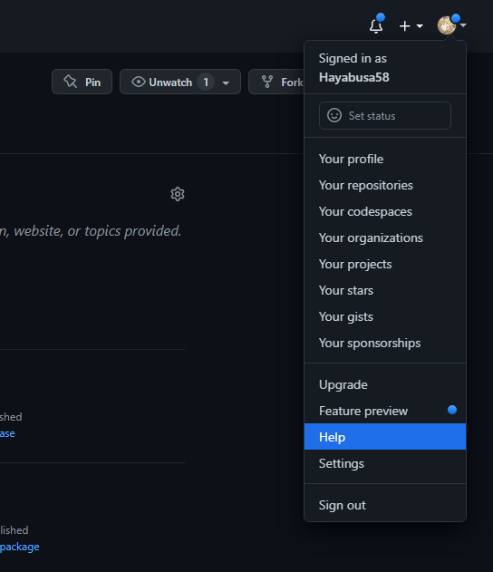
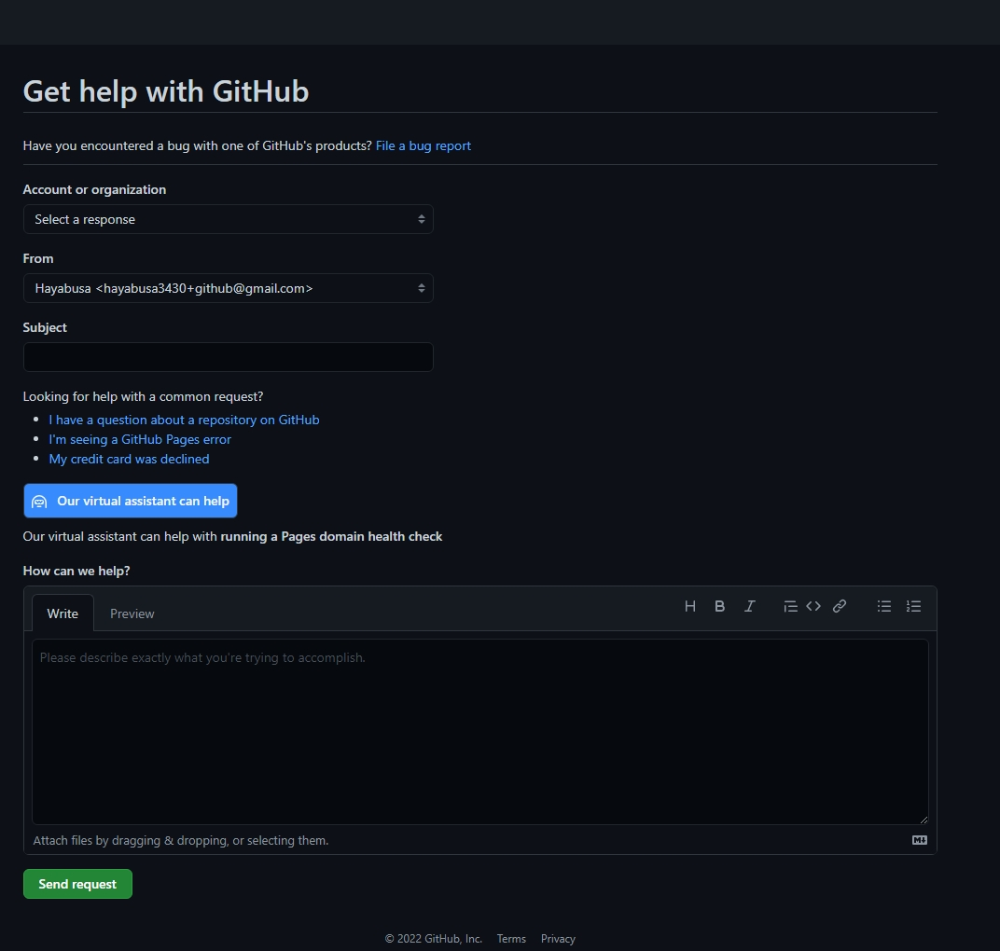

## 概要
このサイトは静的サイトジェネレータであるHugoとGithub Pagesを組み合わせて公開しています。
普段はHugoで生成されたファイルを公開リポジトリにpushするだけで変更内容がすぐに反映されるのですが，
先日なぜかpushした内容が公開サイトに反映されないという現象が起きたため，その対処法をまとめました。

結論から言うとGithubサポートに反映されない旨を送信するとすぐに対応してくれます。

参考: [このサイトのリポジトリ](https://github.com/Hayabusa58/hayabusa58.github.io)

## 問題の詳細
上記のリポジトリを見ていただければ分かる通り，masterブランチにGithub Pagesを紐付けて使用しています。

通常であればmasterに生成されたファイルをpushするだけですぐにサイトに更新が反映されます。
ところが，コミットはリポジトリに反映されているのに，Github Pagesの方に反映されていないという
問題が起きました。

Github Pagesを適用させたリポジトリでは，リポジトリトップページの右下「Environment」の
「Github Pages」というボタンをクリックすると，どのコミットが現在適用されているかが
確認できます。


今回の場合，リポジトリトップページから確認できるコミット履歴は最新のものになっているのに，
このGithub PagesのHistoryには一つ前のコミットが適用されているままになっている，
という状況でした。

### カスタムドメインの問題？
私はこのサイトにGithub Pagesの設定で独自ドメインを適用しているので，最初はその問題を疑ったのですが，
独自ドメイン適用前のURL(```https://***.github.io```)を確認しても最新版が反映されていなかったので，
どうやら独自ドメインは関係なさそうです。

単純にビルドに時間がかかっているだけの可能性もありそうなので，とりあえず丸一日放置してみました。

### Githubサポートへ問い合わせる
丸一日放置してみたものの，反映される気配はありません。

Webで検索してみたところ，やや古い情報ですがGithubサポートへ連絡したら改善したという
[記事](https://qiita.com/kaba_U1/items/9627c58da9d66c6c1388)を見つけました。

この方の場合，連絡しなくても数時間待てば反映されたということなので自分が遭遇している問題と
少し違うような気がしましたが，一応サポートへ投げてみることにしました。

サポート画面は割と深い階層にあり探すのに多少苦労しました。



右上のユーザーアイコンからヘルプをクリックし，


一番下の「サポートへ連絡」をクリック。


トピックを選択する画面になるので，Help with Github Pagesをクリック。


さらに詳細な内容を選ぶ必要があるのですが，この問題に適用できそうなカテゴリはありません。
一番近そうな「Help with a custom domain」を選んでおきました。



やっとここで問い合わせ内容を入力できます。
機械翻訳を使いつつ以下のような英文を送りました。

> Hello.
>
> I have built a site on Github pages using the static site generator Hugo.
> I committed some changes to the site yesterday, but the changes are not reflected in the site.
>
> I have a custom domain set up, so at first I suspected it was a DNS problem with the domain. However, when I access the URL of the domain
> before the change, the change is not reflected, so I think it is probably not a domain problem.
>
> My site is here.
>
> https://hayabusa58.github.io
>
> The repository is here.
>
> https://github.com/Hayabusa58/hayabusa58.github.io
>
> I'd be happy to help.

要約:

> Github Pagesを使ってHugoで作ったサイトをホストしてるんですが，昨日コミットした内容が反映されないんです。
>
> カスタムドメインも使っているのでその問題かと思ったけど違うみたい。
>
> 確認お願いします。(リンク略)

### サポートからの返信と対応
翌日の夕方頃，メールでこんな返信が返ってきました。

> Taking a look I do see where your latest build got stuck and did not complete.
>
> I have taken care of triggering a rebuild of your site, and verified that it completed and that your published website is reflecting the changes in our latest commit.

意訳:

> 君のサイトのビルドがスタックして完了しなかったみたい。
>
> 手動でリビルドしたら最新のコミットが反映されたみたいだから確認してみてくれる？

その言葉通り，ちゃんとサイトへの更新が反映されておりました。よかったよかった。

「Thank you very much!」的な文を送っておきました。

## おわりに
Github Pagesのリポジトリはおそらく星の数ほどあるでしょうに，すぐにこんな丁寧な対応をしてくれて
正直びっくりしています。Github，すごい。

追記: よく考えると，Github PagesでのビルドやデプロイはGithub Actionsとして組み込まれているので，
自分でそれぞれのActionを再実行するだけでも改善したかもしれません。未検証ですが……。
