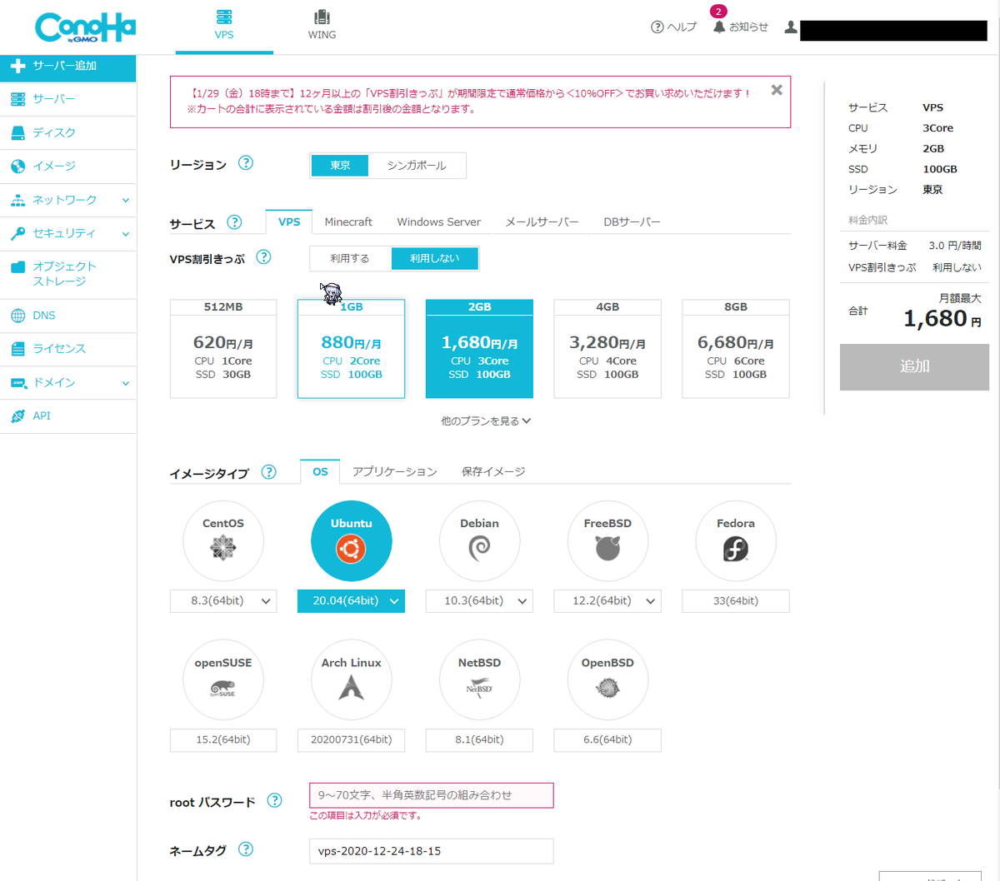

```
※この記事は旧ブログからの移行記事です。
一部を除き，投稿当時からほぼ内容は改変していません。
```


この記事は[Conoha Advent Calender 2020 12/22](https://qiita.com/advent-calendar/2020/conoha)の記事です．
(12/22に登録された方が投稿されなかったため，この枠を使用させていただきました)

## はじめに
お久しぶりです． このブログを更新するのもかなり久しぶりですね．最後の記事投稿が2年前ということに気づいてびっくりしています．

さて，Twitterをフォローしていただいている方はご存知かもしれませんが，最近身内でMinecraftのマルチプレイサーバーを運用しています．  
このときにサーバーを動かすVPSとしてConohaを使用させていただいたので，今回アドカレにサーバーの構築手順を投稿することにしました．

## 前提とする環境

サーバー側の詳細な環境は以下のとおりです．

* Minecraft 1.16.4
* Minecraft Forge 1.16.4-35.1.0
* Conoha VPS 2Gプラン
  * Ubuntu 20.04


Forgeを前提とするModについては，詳細は割愛しますが，サーバー側にCutallなどの一括破壊系と便利系MOD数個程度を導入しました．なお導入するModは，テスト環境にてクライアント側では導入しなくてもログインできることを確認した(=クライアントではForgeだけ導入したら大丈夫)なものだけにしてあります[^1].
[^1]:参加者全員にModの導入方法をレクチャーするのが面倒だったため．

サーバーの操作には主にWindows 10 HomeでPowershell 7を使っています．

## 本記事の特徴
Conohaを始めとするVPSを使ってマイクラ鯖を立てる記事はたくさんありますが，その中でも本記事の特徴は

* 2020/12現在の最新ver.であるMinecraft 1.16.4を使用していること
* マルチサーバーでは珍しくMinecraft Forgeを使用していること
* Conoha VPSに最初から用意されているテンプレートを使用していないこと

以上3点だと考えています。

ちなみにどうしてマルチ鯖界隈で人気のSpigotを使わずForgeを選んだかというと，マルチ鯖を建てるのは未経験の自分はSpigotよりもForgeの操作に慣れているということが一番大きな理由です．(まぁSpigotもそんなに難しいものでもないので，次の機会があればやってみようかなと思っています)

多少なりとも読んでいる方のお役に立てる記事となっていましたら幸いです．

なおこの記事はマイクラ鯖の運用について技術的な部分から紹介したものです．実際に運用して全体的に感じたことなどはまた別記事に書きたいと思います．

## 前準備
では，早速マイクラ鯖構築の手順を紹介しますが，この項では前準備としてConoha VPSのコントロールパネルから設定する項目を書いていきます．

前準備として，Conoha VPSのアカウントを取得し，コントロールパネルにログインしておきます．

ログインできたら，左上の「サーバー追加」ボタンからサーバーを追加します．

サーバーの設定画面では，次のように設定しました．




### テンプレートイメージについて
「サービス」タブでMinecraftテンプレートイメージを選ぶと，比較的ラクにマイクラ鯖の構築ができますが，ここではあえて使用せずに構築することにします．

実を言うと一瞬テンプレートイメージ使うことも考えたのですが，結局やめました．せっかくなのでCLIでの操作を通してLinux力を高めたいということ，(おそらく)テンプレートイメージを使うとMODを導入するのがめんどくさくなりそう，などの理由です．

なおテンプレートイメージを使った構築方法は，Conoha 公式サポートで解説されていますので，そちらをご参照ください．

### 契約プランについて

Conohaでは数カ月分をまとめて契約すると「VPS割引きっぷ」が適用でき，料金が安くなる制度があります．  
ただ，今回はあえてこれも使用せず，1ヶ月単位の契約としました．

そもそもこのマイクラ鯖は身内コミュニティで運用する程度のもので，発案にあたっても(言い方は悪いですが)ある意味「その場のノリ」で立てたような感じがありました．つまりそんなに長期間運用し続けるものではなさそう，と思ったので，気軽に建てて気軽に止められる1ヶ月契約としました[^2]．他の方も書いておられましたが，Conohaは軽率に借りて軽率に爆破できるお手頃なVPSで，こういうときは本当に助かります．
[^2]:もちろん最初から長期契約にして，使わなくなったら別用途に転用，でもいいと思います

### メモリの設定について
サーバーの設定で一番迷ったのはここでした．
マルチ鯖未経験の自分にはどのくらいのメモリがあれば快適に遊べるのかさっぱりわかりませんでした……

結論から言うと，「身内と」「数個のModを導入して」プレイする程度であれば2GBで十分だと感じました．
ここでいう「身内」とは，最大ログイン人数6人くらいを指します．6人はそれぞれ回線の良し悪しもまちまちで，おのおののPCスペックにもかなり差がありましたが[^3]，概ね快適に遊べています． Modは前述の通りサーバー側にいくつか軽いものを入れただけです．
[^3]:上はRTX2000番台を積んだn十万円のゲーミングPC，下は普通のノーパソとかなりの幅

ただし，ワールドマップが徐々に開拓され，トラップタワーなどのMobが多く負荷の高い施設がワールドに作られていくと，同時ログイン数が多いときには多少のラグが起こるようになりました．具体的には，食べ物を食べても満腹度が回復しない，突然移動がリセットされる，チェストやかまどなどのGUIが開けない，などの症状です．  
これらのラグについて，メモリの不足が原因であるのかはまだわかっていません．現状耐えられないようなものではないので，しばらく様子見しています．もしこれ以上ひどくなるようであればメモリの増量も検討します．

### イメージタイプについて
OSはUbuntu 20.04にしました．理由は一番好きだからです．

### その他
rootパスワードはしっかりしたものを設定してください．失念するとかなりめんどくさくなるのでメモを忘れずに．

## VPS導入後のマイクラ鯖の構築
それでは，実際にVPSにログインして鯖を構築していきます．

Conohaのコントロールパネルから起動できるWebコンソールでも良いのですが，何かと便利なので自分はPowershellからssh接続して操作しています．sshについてはWeb上にたくさん情報がありますのでここでは省略します．

なおここでは省略していますが，作業はUbuntuに専用のユーザーを追加して行うことをおすすめします．[^4]
[^4]:とかいいながら最初めんどくさくてずっとrootでやってました．ごめんなさい……

### 必要なソフトウェアのダウンロード&インストール
マイクラ鯖に必要なソフトウェアをインストールしていきます．といっても，必要なものはOpenJDKと，MinecraftForgeの本体，セッション永続化のためのscreenくらいです．

まずOpenJDKをインストールしました．

```
$ sudo apt install openjdk-1.8.0-jre
```

これでOK．

続いてForge本体をダウンロードしていきます．マイクラ鯖を設置するディレクトリを作成し，そこに移動します．  
自分は~/Minecraft/ForgeSV/<バージョン別のディレクトリ>/に設置しました[^5]．
[^5]:適当に作ったけど，これが適切な場所なのかはわからないです．

予め，操作しているPCのブラウザを開き，Minecraft Forgeの公式サイトに移動します．  
ダウンロードしたいバージョンの「Installer」をクリックすると，ファイルが落ちてくる前に広告が表示されます．ここで，右上に出てくる「Skip」ボタンを右クリックして，リンクをコピーしておきます．これがForge本体の直リンクになります．

続いてssh接続をしているコンソールに戻り，以下のコマンドを入力して実行します．

```
$ wget https://files.minecraftforge.net/.../<ダウンロードしたいバージョン>
```

しばらく待つと，Forgeのインストーラーがダウンロードされます．「Forge-<バージョン>-installer.jar」というファイル名になるようです．

次にForgeサーバーをインストールします．

```
$ java -jar Forge-<バージョン>-installer.jar --installServer
```

カレントディレクトリに，サーバーに必要な様々なフォルダやファイルが生成されます．インストールが終わったら，サーバーファイル本体(「forge-<バージョン>-.jar」の名前のファイル」が存在することを確認しましょう．

インストール完了後，インストーラーとそのログファイルは削除しても大丈夫です．

最後に，セッション永続化のためのscreenコマンドをインストールしておきます．

```
$ sudo apt install screen
```

サーバーの起動
インストールが終わったら，サーバーを起動します．まず，以下のコマンドを適当なテキストエディタでスクリプトファイルに書き込みます．

```
java -Xmx2000M -Xms2000M -jar forge-<バージョン>-.jar
```

自分はこれをstart.shとして保存しました．
起動スクリプトができたら，これを叩いてみます．

すると，初回起動なのでeula.txtに同意してくださいというメッセージとともにサーバーが終了します．
eula.txtを熟読し，同意できればfalseをtrueと書き換えて保存します．

再び起動スクリプトを叩いてみて，無事サーバーが起動すればひとまず構築は完了です．

### ポートの開放設定
サーバーは起動できましたが，このままでは外部からログインできません．ポートを開放してあげる必要があります． Ubuntuの場合，以下のコマンドでポートを開放できます．  
Minecraftが使用するポートは25565です．後述の，rconを有効にするには25575も開放する必要がありますが，通常は必要ありません．

まず，ファイアウォールを起動します．

```
$ sudo ufw enable
```

続いてポートの開放と再読み込み．

```
$ sudo ufw allow 25565
$ sudo ufw reload
$ sudo ufw status
```

ポート番号25565が許可されていたら成功です．

### セッションの永続化
このままではターミナルを終了するとサーバーも落ちてしまうので，起動スクリプトを少し改造してセッションを永続化します．自分は以下のように設定しました．

```
$ screen -AmdS mc java -Xmx2000M -Xms2000M -jar forge-<バージョン>-.jar
```

このスクリプトを実行すると，一見なにも起こりませんが，裏でマイクラ鯖(mcと名付けられたセッション)が起動しています．セッションに移動するためには

```
$ screen -r mc
```

とします．これでマイクラ鯖のセッションにアタッチできるので，自由にコマンド等も実行できます．

セッションから離れる(デタッチする)には，単に

```
$ screen -r
```

とします．

ここまでできたら，自分でクライアントを立ち上げて接続できるかテストします．

### Modの導入
最後にサーバー側Modの導入です．といってもこれは簡単で，サーバーディレクトリにあるmodsディレクトリに導入したいModのjarを追加するだけです．ただし，クライアントMod(Optifineなど)を導入しても意味がないので注意してください．

これでひとまずサーバー構築完了です．サーバーIP(Conohaのコントロールパネルで確認できます)を参加者に伝えて接続してもらいましょう．

## その他の設定
ここからは，運用中に変更した細かい設定等を紹介します．余談に当たるので，必要ない方は読み飛ばしていただいて大丈夫です．

### server.propertiesの編集
サーバーディレクトリに生成される，server.propertiesを編集することで，マイクラの設定の変更ができます．
実際に変更した項目は以下の通り．

```
# rconの許可(詳細は後述します)
enable-rcon=true

# rconパスワードの設定
rcon.password=<パスワード>

# ワールド名の変更
level-name=<ワールド名>

# シード値の変更
level-seed=<シード値>

# エンティティ描画距離の変更(ラグ軽減)
entity-broadcast-range-percentage=50

# サーバーが応答しない場合，自動でサーバーが終了するまでの時間(ミリ秒)
max-tick-time=12000

# 独自サーバーリソースパックの指定
resource-pack=<サーバーリソースパックのURI>

# 初期スポーン付近の保護の解除
spawn-protection=0
```

ここでrconとは，リモートコンソールプロトコルのことで，これを有効にすることでマイクラ鯖のコンソールにインターネットを経由してリモートで接続できるようになります[^6]．なぜこれを有効にしたかというと，Discord経由でマイクラ鯖にコマンドを送信して操作したかったためです．
[^6]:rconで使用するポートは25575なので，別途開放する必要あり

### Discord経由でのマイクラ鯖の操作
実際に運用を開始してみると，

* 自分がバイトや授業などで手が離せないときでも/reloadや/stopといった基本的なコマンドを送信できるようにしたい
* 今誰がログインしているのか確認したい
* ワールドデータのバックアップがめんどくさい

といった課題が浮かびました．
そこで，まずDiscordとマイクラを連携する手段を探しましたが，適当なものがありませんでした．そこで，Pythonで簡単にDiscord Botが作れるdiscord.pyというライブラリを用いて，自前でBotを作ってみました．

……本当はここでBotの詳細を紹介する予定だったのですが，まだ公開できるほど完成度が高くないのでここでは概要の紹介にとどめます．

動作イメージはこんな感じ．


今実装しているのは，現在の鯖の状況を確認する$statusコマンド，リロードができる$reload'コマンド，サーバーを停止できる'$stop'コマンドなどです

今後，自動バックアップ機能やロギング機能等も実装する予定です．

## 終わりに
軽めの記事にしようと思っていたのに，予想以上に長くなってしまいました．

突貫工事で書いたので，内容にミス等ありましたらごめんなさい．できればコメントやTwitter等で教えていただけると大変助かります．

それでは．

## 参考ページ
OpenJDK（Java）を最新のUbuntuにインストール - Qiita https://qiita.com/terappy/items/537c069923144a9d9755

Ubuntu ServerにMinecraft forge入れた - Spica* https://esperia.hatenablog.com/entry/2015/07/10/002752

server.properties - Minecraft Wiki https://minecraft-ja.gamepedia.com/Server.properties
