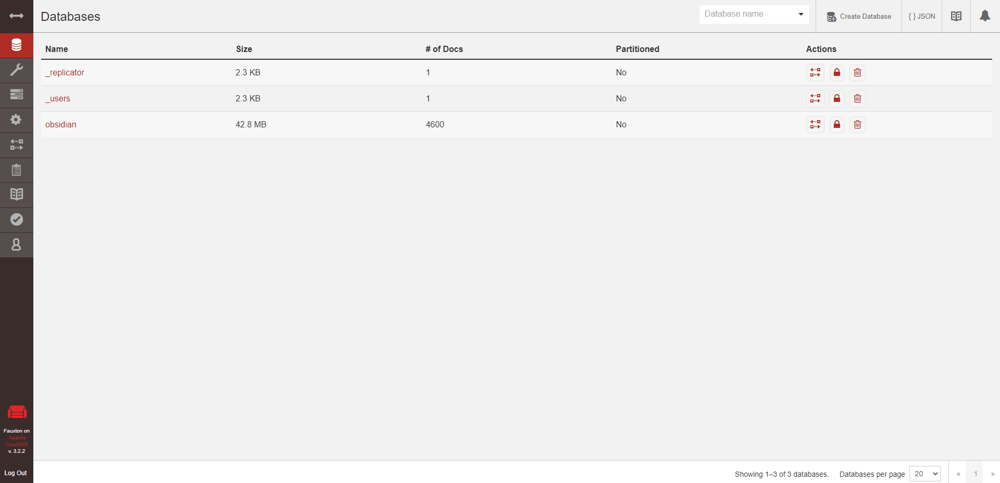

## 要約
この記事では，MarkDownエディタ「Obsidian」のSelf-hosted LiveSyncプラグインのデータベースサーバーをVPS(Conoha)で使用する方法を記載しています。

[Self-hosted LiveSyncのデータベースをVPS上で構築](#self-hosted-livesyncのデータベースをvps上で構築)から本題なので，そこまでは読み飛ばしていただいて大丈夫です。

なお，こちらはあくまで趣味の範疇の記事であり，内容には十分注意していますが，誤りが含まれている可能性があります。

このサイトにはコメント欄は設けていないので，質問やご指摘は[Twitter](https://twitter.com/h_ya58)までお寄せいただければと思います。

## まえがき
お久しぶりです。

ブログに書きたいことはあったんですが気力がついてこず，永遠に放置していました。

久々にちゃんと書く時間＆気力が戻ってきたので更新します。

さて，私はしばらく前から調べたことや自分で得た知見，考えたことを積極的にメモするようにしているのですが，そこで使用するメモツールとして，以前はデバイス間同期機能が優秀なOnenoteを使用していました。

しかし，使っていくとOnenoteの動作のもっさり感・日本語への対応が微妙感・UIに今一つ馴染めない感・Microsoftにすべてのデータを預けている不安感などなどのデメリットを感じるようになったため，今回ObsidianというMarkDownエディタに移行しました。

Obsidianはざっくり言うとMarkDownエディタですが，ファイル間のリンクがスムーズに行えるため，ファイルの集合が一つの連結したデータベースとなるというメリットがあります。この連結は人間の脳内の思考がつながっているのをイメージしているとのこと。

もちろんエディタとしての機能も非常に優秀で，動作も軽量なため今のところ満足して使っています。

Obsidian本体の紹介については他に多くの方がすでに書いてくださっているのでそちらに譲りますが，その他にも多くの便利な機能がありますので，興味のある方はぜひ調べてみてください。(周りにユーザーが少なくてちょっと悲しい)

私が導入にあたって参考にさせてもらった記事を以下に掲載しておきます。

Obsidianは最高のマークダウン『メモ』アプリである  
https://pouhon.net/obsidian-introduction/5666/

私は先述のメリットに加え，もともとMarkDown記法になじんでいたことや，データの実体がただの.mdファイルになるので，完全にローカルな環境にデータを保存することになるので特定の企業に依存することがないということ[^obsidian_backup]に魅力を感じたため使い始めました。

さて，Obsidianを導入したのはいいのですが，先述の通りObsidianで編集するファイルはただの.mdファイルですので，特に設定をしない場合普通にローカルストレージに保存されるだけになります。

私はメインPCに加えてサブのノートPCやスマホやiPadでも完全に同じデータを編集したかったので，何らかの方法で端末間同期を実現する必要があります。

## 端末間同期方法の調査

ObsidianはMarkdownファイルをVaultという単位で管理しているので，要はこのVault内のファイルを複数端末でうまく同期できるようになればいいみたいです。

調べてみると，この端末間同期にはかなりいろいろやり方があるみたいでややこしくなっていました。その詳細については以下の記事に詳しくまとめてくださっているのでそちらをご覧ください。

Obsidianの複数端末同期方法まとめ (Mac/Windows/iOS/Android)  
https://pouhon.net/obsidian-sync/6796/

私はMacを持っていないので，同期したい端末はWindows・iOS・Andoroidになります。この3種類の端末間でVaultを同期する方法は大きく分けて

1. Obsidian Syncという公式の同期機能を利用する(有料)
2. Self-hosted LiveSyncプラグインを利用する
3. Gitプラグインを利用し，Githubにファイルを保管する

の3つがあります。(導入が簡単な順に並べました)

このうち，1については1月当たり約1000円の費用が発生する他，Obsidian公式のサーバにデータを保管するので，他社のサーバに依存することになり，本末転倒な気がしたのでやめました。

3については，Gitに対して特に抵抗があるわけではないのですが，ファイルを編集するたびにcommit & pushの手間が発生するのは面倒くさく，Onenoteのようにシームレスに同期をしたいということでこちらも却下。

残ったのは2のSelf-hosted LiveSyncプラグインを利用する方法です。

Self-hosted LiveSync  
https://github.com/vrtmrz/obsidian-livesync/blob/main/README_ja.md

こちらは，Obsidianのコミュニティプラグイン「Self-hosted LiveSync」を使用するもので，自分でデータベースサーバを用意し，各Markdownファイルの情報をサーバを通じて各端末と同期するという方式のようです[^self-host-sorry]。

データベースサーバを用意する手間はかかりますが，自前のサーバ上にデータを置け，かつ同期も非常にスムーズに行えるとのことで，今回はこちらの方法を採用することにしました。

## Self-hosted LiveSyncのデータベースをVPS上で構築
さて，Self-hosted LiveSyncの公式ドキュメントでは，データベースサーバを手軽に構築する方法としてIBM Cloudantをおすすめしていました[^self-host-ibm]が，IBM Cloudantは無料枠では1GBまでしかデータを保存できないようです。

MarkDownファイルにテキストだけ書いていく人ならこれで十分そうですが，私はファイルにスクショの画像ファイルを張り込む(正確には画像ファイルへのリンクを貼る)ことが多く，Self-hosted LiveSyncではVault内にあるファイルまで同期するため，将来的なIBM Cloudantの容量に不安を感じ[^obsidian-storage]，別の手段を取ることに。

そこで以前契約したVPSが余っていることを思い出し，こちらにデータベースサーバを構築することにしました。

なお使用したVPSはConoha VPS，OSはUbuntu 20.04です。

### Couch DBのインストール
Self-hosted LiveSyncはCouch DBというデータベースを使用します。

自前のサーバにCouch DBを構築する手順は先述のSelf-hosted LiveSyncの公式ドキュメントに案内があります。

https://github.com/vrtmrz/obsidian-livesync/blob/main/docs/setup_own_server_ja.md

今回は，ドキュメントでおすすめされていたDockerのイメージを利用してCouch DBを構築することにしました。

まず，UbuntuにDockerをインストールします。

Dockerをインストールするにはsnapというパッケージシステムが便利なようです。

`$ sudo apt install -y snap`

でsnapコマンドをインストールし

`$ sudo snap install docker`

でDockerをインストールします。

Dockerイメージをダウンロードし実行するには，

`$ sudo docker run -d --name obsidian-sync-couchdb couchdb:latest`

この辺りのコマンドは，

couchdb - Official Image | Docker Hub  
https://hub.docker.com/_/couchdb

1.5. Installation via Docker — Apache CouchDB® 3.2 Documentation  
https://docs.couchdb.org/en/3.2.2-docs/install/docker.html

を参考にしました。

### Couch DBの設定と実行
つづいて，Couch DBをSelf-hosted LiveSyncで使えるように設定を行います。

適当なディレクトリに以下のlocal.iniを作成します。
```
[couchdb]
single_node=true

[chttpd]
require_valid_user = true

[chttpd_auth]
require_valid_user = true
authentication_redirect = /_utils/session.html

[httpd]
WWW-Authenticate = Basic realm="couchdb"
enable_cors = true

[cors]
origins = app://obsidian.md,capacitor://localhost,http://localhost
credentials = true
headers = accept, authorization, content-type, origin, referer
methods = GET, PUT, POST, HEAD, DELETE
max_age = 3600
```

これはSelf-hosted LiveSyncの公式ドキュメントのコピペです。

以下のコマンドでCouch DBを起動します。

`$ sudo docker run --rm -it -e COUCHDB_USER=admin -e COUCHDB_PASSWORD=password -v /path/to/local.ini:/opt/couchdb/etc/local.ini -p 5984:5984 couchdb`

-eオプションで環境変数`COUCHDB_USER`と`COUCHDB_PASSWDを`指定します。この2つはデータベースの管理者ユーザー情報で，適宜自分の作成したものに置き換えてください。

-vオプションはDockerのバインド・マウントという，ホスト側のディレクトリとコンテナ内のディレクトリを同期する機能だそうです。

Dockerのバインド・マウントを利用する  
https://noumenon-th.net/programming/2019/03/30/docker-v/

この場合，local.iniまでの絶対パスを指定します。今回のようにファイル(local.ini)のパスを指定した場合，local.iniというデータボリュームが自動的に作成され，コンテナ内のデータが保存されるとのことです。

最初これを相対パスにしており，「データボリュームに相対パスは使えないよ」的なエラーが出てちょっとハマりました。

Couch DBをバックグラウンドで起動するには以下のコマンドを実行します。

`$ sudo docker run --rm -it -e COUCHDB_USER=admin -e COUCHDB_PASSWORD=password -v /path/to/local.ini:/opt/couchdb/etc/local.ini -p 5984:5984 couchdb`

-pオプションで使用するポート番号を指定します。例の通り，5984番ポートを使いました。

### リバースプロキシの設定
PCからのみアクセスするならSSLの設定はいらないみたいですが，モバイルアプリからアクセスするためにはSSL証明書が必要です。

今回はリバースプロキシサーバとしてCaddyというアプリケーションを利用しました。

Caddy ウェブサーバー - がとらぼ  
https://gato.intaa.net/archives/29698

Install — Caddy Documentation  
https://caddyserver.com/docs/install#debian-ubuntu-raspbian

インストールは以上の記事を参考にしました。

Caddyは簡単なリバースプロキシサーバならコマンド一つで構築できるWebサーバとのこと。

リバースプロキシを設定する前にドメインとDNSの設定をしておきます。(ドメインを使用せず生のIPを使用する場合は不要です)

今回は新しくドメインを取得し，DNSのAレコードにVPSのIPアドレスを設定しました。

例として`obsidian.example.com`というドメインを使用します。

テストのためCaddyのリバースプロキシサーバをワンライナーで実行してみます。
`$ sudo caddy reverse-proxy --from obsidian.example.com --to localhost:5984`

上記コマンドで，`obsidian.example.com`から`localhost:5984`までのリバースプロキシサーバが起動します。

本起動のため，`/etc/Caddyfile`という設定ファイルを作ります。

今回は以下のような内容で作成しました。
```
obsidian.example.com {
  reverse_proxy {
    to localhost:5984
  }
  log {
    output file /var/log/caddy/obsidian.example.com.info-access.log
  }
}
```
logセクションにはCaddyのアクセスログを保存する場所を指定しています。

`$ sudo caddy start --config /etc/Caddyfile`

`caddy start`コマンドでCaddyをバックグラウンドで起動することができます。

リバースプロキシサーバが正常に起動したら，ファイアウォールで80番ポートを開き，5984番ポートは閉じておきます。

### Couch DBの初期設定
ここで，`obsidian.example.com/_utils#setup` にブラウザからアクセスすると，データベースサーバの設定画面に入ることができます。


こちらのスクショはすでに設定済みですが，初期状態だと`_replicator`と`_users`の2つのシステムデータベースしかできていないはずです。

Obsidian用のデータベースを左上の「Create Database」ボタンから作成します。

クリックすると名前を指定するダイアログが出るので，適当な名前を入れて作成します。

CouchDBの初期設定には以下のドキュメントを参考にしました。

2.1. Single Node Setup — Apache CouchDB® 3.2 Documentation  
https://docs.couchdb.org/en/3.2.2-docs/setup/single-node.html

### Obsidianの設定
データベースサーバが立ち上がったら，同期したい端末のObsidianにコミュニティプラグインからSelf-hosted LiveSyncをインストールします。

あとはObsidianの設定からSelf-hosted LiveSyncを選び，セットアップウィザードに従って設定します。

手順については公式ドキュメントに詳しく解説されています。

obsidian-livesync/quick_setup_ja.md at main · vrtmrz/obsidian-livesync · GitHub  
https://github.com/vrtmrz/obsidian-livesync/blob/main/docs/quick_setup_ja.md

ここでRemote databaseの設定では，今回の例では
```
URI: obsidian.example.com
UserName: admin
Password: passwd
database name: obsidian
```
等の値を入力します。

そのままウィザードに従って設定を進め，正常にサーバと通信できれば完了です。


## あとがき
久々にブログを書いたら思ったより長くなってしまった……。

書き出せば一気に書けるのですが，やっぱり疲れますね。

また時間と気力を見つけてぼちぼち更新していきたいです。

[^onenote_merit]: ただし，OnenoteのiOSアプリのApple Pencilによる手書き機能はなかなか使いやすいので，手書きが必要な大学の講義資料の作成用途としては使い続けています。

[^obsidian_backup]: もちろんその分バックアップを別途確保する必要があります。

[^self-host-sorry]: 正確なところまで理解できている自信がないので，間違っていたらすみません……

[^self-host-ibm]: https://github.com/vrtmrz/obsidian-livesync/blob/main/README_ja.md

[^obsidian-storage]: 参考までに，.mdファイルが約100個，画像ファイルが約50個のVaultで概ね30MBとなっていました。容量の8割ほどを画像ファイルが占めています。