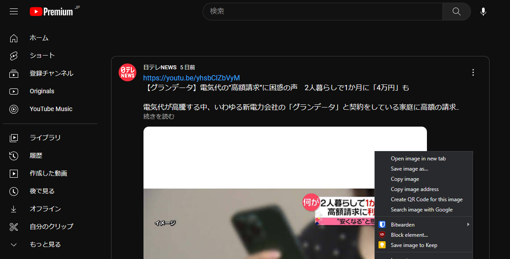
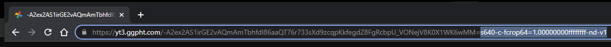
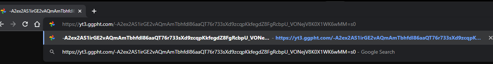

## Youtubeコミュニティの画像は直接原寸サイズで保存できない
Youtubeのコミュニティに投稿された画像を単に右クリックして保存すると，縮小されたサイズになってしまうようです。

あるチャンネルでメンバーシップ限定で公開されていた壁紙をダウンロードしたところ，
1600x900という変なサイズになっていたことで気づきました。でもどうしてこんな仕様にしているんでしょうか……。

## 対処法はURLのパラメータを変更すること
調べたところ次のような対処法が見つかりました。

1.コミュニティタブで，投稿に含まれる画像をクリックして投稿の個別ページに飛ぶ


2.個別ページの画像を右クリックして「新しいタブで開く」


3.URL末尾の`s=`から始まる部分をすべて削除し，`s=0`に書き換えて再読み込み





これで無事原寸サイズの保存が表示されるので，あとは右クリックから保存すればOK。

こちらの対処法は以下のツイートを参考にさせていただきました。

<blockquote class="twitter-tweet"><p lang="ja" dir="ltr">YouTubeのコミュニティの画像をオリジナルサイズで表示する方法 <a href="https://t.co/MJDWC7Ln1R">pic.twitter.com/MJDWC7Ln1R</a></p>&mdash; むふー (@4chouyou) <a href="https://twitter.com/4chouyou/status/1280812404784291840?ref_src=twsrc%5Etfw">July 8, 2020</a></blockquote> <script async src="https://platform.twitter.com/widgets.js" charset="utf-8"></script>

コミュニティ投稿の例として，[日テレNEWSさんの投稿](https://www.youtube.com/channel/UCuTAXTexrhetbOe3zgskJBQ/community?lb=UgkxIgnw4kf9-mNqxENq7Tkv96FilW2q4Rpi)をお借りしました。

## URLを書き換えるブックマークレットを作った

一連の手順のうち，3のURLを書き換える処理を行うブックマークレットを作成しました。

```
javascript:(function(){url=document.location.href;reg=/=s.*/;new_url=url.replace(reg, "=s0");document.location.href=new_url;})();
```

これをブックマークに登録し，2の画像を新しいタブで開いた時点で実行すると原寸大サイズの画像が表示されます。
頑張れば画像のDLまで自動化できそうですが，そこまで頻繁にする作業ではないのでいいかなと。

圧縮前のコードはこちら。
```
function(){
    url = document.location.href;
    reg = /=s.*/;
    new_url = url.replace(reg, "=s0");
    document.location.href=new_url;
    }
```
単にURLの書き換えたい部分を正規表現でマッチして置換しているだけです。

## あとがき
検索してもまとまった情報が見当たらなかったのですが，最近変わった仕様なんでしょうか？

Youtubeのコミュニティは視聴者としても気軽に見られて便利ですが，壁紙のような画質が重要なコンテンツには向いていない気もします。